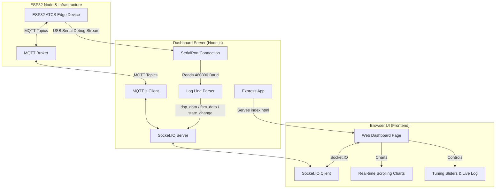

# Acoustic ATCS Proxy Node Tuner Dashboard

## Overview

The Acoustic ATCS Proxy Node Tuner Dashboard is a real-time tuning and monitoring dashboard for the ATCS Proxy Node (ESP32 edge device). It provides two main modes of interaction:

1. **USB Serial Interface:** Connects directly to the ESP32 node via USB at a baud rate of 460,800 to stream and parse raw DSP frames (frequencies, SNR, RMS) and FSM state transitions, rendering them in real-time charts.
2. **MQTT Interface:** Connects to a central MQTT broker to receive events, heartbeats, and telemetry published by the edge device, and enables remote, live tuning of all node configuration parameters (DSP thresholds, cycle filters, and sleep schedules).

The dashboard is built as a lightweight Node.js application using Express, Socket.IO, SerialPort, and MQTT.js, with a single-page web interface for real-time visualization.

## System Architecture

The diagram below shows how the dashboard acts as the bridge between the physical ESP32 node (via USB Serial), the MQTT broker, and the browser UI:



---

## Configuration & Environment Variables

You can configure the HTTP port and the MQTT broker URL using either command-line arguments or environment variables. Command-line arguments always take precedence.

| Setting | CLI Flag | Environment Variable | Default Value |
| :--- | :--- | :--- | :--- |
| **Server Port** | `--port <number>` or `--port=<number>` | `PORT` | `3000` |
| **MQTT Broker** | `--mqtt-broker <url>` or `--mqtt=<url>` | `MQTT_BROKER` or `MQTT_URL` | `mqtt://localhost:1883` |

*Note: If no protocol (e.g. `mqtt://` or `mqtts://`) is specified in the broker URL, the dashboard will automatically prefix it with `mqtt://`.*

### Example Configurations

**Using CLI Flags:**

```bash
npm start -- --port=8080 --mqtt-broker=192.168.1.150
```

**Using Environment Variables (via `.env` or Shell):**

```bash
PORT=8080 MQTT_BROKER=mqtt://192.168.1.150 npm start
```

---

## Getting Started

### Prerequisites

* Node.js (v18 or higher recommended)
* npm (installed with Node.js)
* A running MQTT Broker (e.g., Mosquitto) if using MQTT remote configuration.

### Installation

1. Navigate to the dashboard directory.
2. Install the required dependencies:

    ```bash
    npm install
    ```

### Running the Dashboard

* **Production / Standard Mode:**

    ```bash
    npm start
    ```

* **Development / Auto-reload Mode:**
    Runs the server using Node's built-in file watcher:

    ```bash
    npm run dev
    ```

Once started, open your web browser and navigate to `http://localhost:3000` (or your configured port) to access the dashboard.

---

## Functional Features

### 1. Connection Panel

* **Serial Connection:** Scan for available COM/tty ports, choose the port connected to the ESP32, and click **Connect**. The server will automatically lock to 460,800 baud and begin parsing data.
* **MQTT Connection:** Displays connection status to the configured broker and connects automatically upon launch.

### 2. Live Graphing & Telemetry

* Plots real-time lines for the Goertzel magnitude of target frequencies (1253 Hz, 662 Hz) alongside the ambient noise baseline (900 Hz).
* Plots live SNR values and FSM states (`IDLE`, `PROBING`, `ACTIVE`) so you can visually correlate buzzer pulses with state changes.

### 3. Remote Parameter Tuning

* Provides sliders to adjust DSP thresholds (`main_snr_db`, `sec_snr_db`, `alpha_attack`, `alpha_decay`) and FSM timings (`cycle_target_ms`, `cycle_tolerance_ms`, `required_cycles`).
* Includes a **Persist to NVS** checkbox. When enabled, settings will survive an ESP32 hardware reboot.
* Click **Apply** to publish the changes immediately to the `crossing/config` topic.
* Click **Refresh** to request the node's current configuration from the NVS storage via the `crossing/config/req` topic.

### 4. Interactive Event Log

* Displays a scrolling list of all raw log strings received from the Serial port, as well as incoming and outgoing MQTT payloads (events, heartbeats, and config ACKs).
